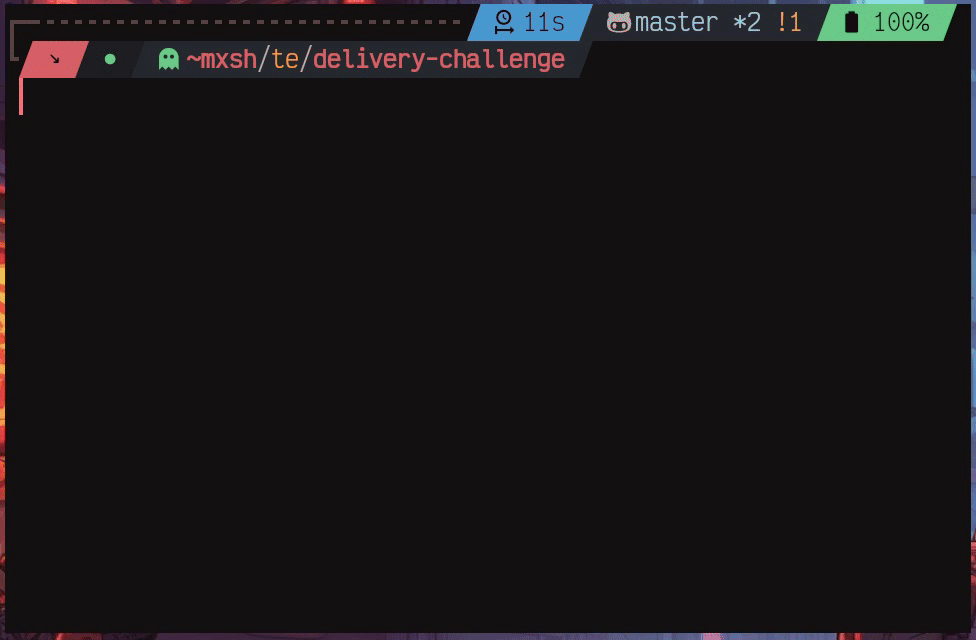

# Mail delivery trains challenge

## Related

- [metaory/advent-of-code](https://github.com/metaory/advent-of-code)

## Requirements

- Node 16+

## Dependencies

- `Chalk` - Terminal string styling

## How to run

```bash
npm install
npm start
# or
npm start input-basic.json
npm start input-edge.json
npm start input-advance.json
npm start test-file-name.json
```

---

## Generate random test input

Randomly generate new test inputs:

```bash
# interactively generate and run solution
npm run generate

# forcefully generate and run solution
npm run generate force
```

<p align="center">
  
</p>

---

## Challenge

_You have been asked to write a program to control a network of **autonomous mail delivery trains**_

Each instance of this problem has:

- [A network, consisting of a set of nodes, each described by a (string) name]

- [A set of edges, each of which links two nodes and has journey time in seconds]
- [Edges are undirected and
  any number of trains can travel along any edge in any combination of orders
  An edge is uniquely described by a pair of nodes]

- [A set of trains in the network, each of which has a maximum total weight it can carry]

- [All trains start off empty and each train has a node where it starts off]

- [There is a set of packages in the network,
  each of which has a weight and starts off located at a node,
  and each of which has a destination node]

The problem is solved when all packages are **located at their destination nodes**

_We would like you to write (or think about) a program which takes as input_:

- [A list of node names, `[ Node1, Node2, .. ]`]
- [A list of edges, `(Name, Node1, Node2, JourneyTimeInMinutes)`]
- [A list of trains `(TrainName, CapacityInKg, StartingNode)`]
- [A list of packages, `(PackageName, WeightInKg, StartingNode, DestinationNode)`]

_And produces as output a list of moves. **Each move should contain**_:

- [The time at which the move occurs, in seconds, `W`]
- [The name of a train which moves, `T`]
- [The node that the train starts at, `N1`]
- [The names of the packages the train picks up at the start node, `P1`]
- [The node that the train finishes at, `N2`]
- [The names of the packages the train drops off at the finishing node, `P2`]

_For clarity_:

- [`P1` and `P2` may be empty]
- [`N1` may be equal to `N2` No time is taken moving a train from a node to itself]
- [No time is taken to load or drop off packages]
- [No train may ever carry more than its capacity]
- [There must be an edge (`N1`,`N2`)]
- [The train will take the journey time for that edge to move from `N1` and `N2`
  and may not do anything else whilst it is travelling]
- [Any number of trains may travel down any edge in either direction at once]
- [Any number of trains may be at any node at any time (nodes have no capacity limit)]
- [Each train may carry any number of packages, long as it does not exceed capacity]
- [Trains may end the sequence of moves anywhere]
- [A train must start its next move at the destination node for its previous move
  (or at its starting node if it has not yet moved) - trains cannot teleport]

**At the end of your sequence of moves,
all packages must have been dropped off at their destination node**

**We define the solution time as the earliest time
at which all packages have been dropped off at their destination node**

Solution `S1` is better than `S2` if the solution time is lower in `S1` than in `S2`

_We like the best solution possible, but correctness is more important than optimality_

---

`3` // number of stations

`A` // station name

`B` // station name

`C` // station name

---

`2` // number of edges

`E1,A,B,30` // route from `A` to `B` that takes `30` minutes

`E2,B,C,10` // route from `B` to `C` that takes `10` minutes

---

`1` // number of deliveries to be performed

`K1,5,A,C` // package `K1` with weight `5` located currently at station `A` that must be delivered to station `C`

---

`1` // number of trains

`Q1,6,B` // train `Q1` with capacity `6` located at station `B`

---

// Move `Q1` to `A` via `E1`, takes `30` minutes

`W=0, T=Q1, N1=B, P1=[], N2=A, P2=[]`

// Now move back to `B` Takes `30` minutes

`W=30, T=Q1, N1=A, P1=[K1], N2=B, P2=[]`

// Move to `C` and drop off - takes `10` minutes

`W=60, T=Q1, N1=B, P1=[], N2=C, P2=[K1]`

---

// Takes `70` minutes total

---

##### Input

```javascript
// input-edge.json
{
  stations: [ 'A', 'B', 'C', 'D', 'E' ],
  edges: [ 'E1,A,B,30', 'E2,B,C,10', 'E3,C,D,40', 'E4,D,E,15' ],
  deliveries: [ 'K1,1,A,D', 'K2,2,C,E', 'K3,4,B,D' ],
  trains: [ 'Q1,4,C', 'Q2,5,B' ]
}
```

---

##### Initial reduced structures

```javascript
// positions
{ A: 0, B: 1, C: 2, D: 3, E: 4 }

// connections
{ A: [ 'B' ], B: [ 'A', 'C' ], C: [ 'B', 'D' ], D: [ 'C', 'E' ], E: [ 'D' ] }

// distances
{ 'A-B': 30, 'B-A': 30, 'B-C': 10, 'C-B': 10, 'C-D': 40, 'D-C': 40, 'D-E': 15, 'E-D': 15 }

// delivery status
{ K1: Symbol(AT_PICKUP), K2: Symbol(AT_PICKUP), K3: Symbol(AT_PICKUP) }

// train stations
{ Q1: 'C', Q2: 'B' }

// train capacities
{ Q1: 4, Q2: 5 }

// train loads
{ Q1: [], Q2: [] }

// train timeline
{ Q1: 0, Q2: 0 }
```

---

##### Outcome

```javascript
// moves
// *L is train load
[
  'W=0, T=Q2, N1=B, P1=[K3], N2=A, P2=[], L=[K3]',
  'W=30, T=Q2, N1=A, P1=[K1], N2=B, P2=[], L=[K3,K1]',
  'W=60, T=Q2, N1=B, P1=[], N2=C, P2=[], L=[K3,K1]',
  'W=70, T=Q2, N1=C, P1=[], N2=D, P2=[K3,K1], L=[]',
  'W=0, T=Q1, N1=C, P1=[K2], N2=D, P2=[], L=[K2]',
  'W=40, T=Q1, N1=D, P1=[], N2=E, P2=[K2], L=[]'
]

// input-edge.json
// After adding the final leg of journey duration
// The highest is Q2; 70 + 40(C-D is 40)
Solution time is: 110
```
